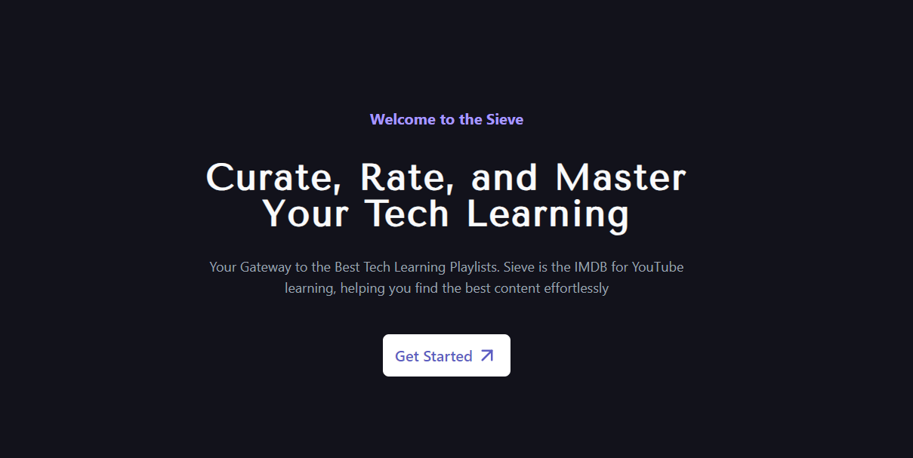

# Sieve 🎬📚

Welcome to **Sieve**, an IMDB-like platform for discovering and rating the best YouTube playlists or videos on software development, web development, programming languages, frameworks, design, open source, and more. This platform aims to help newcomers and enthusiasts find high-quality and most-rated tutorials.



## Table of Contents 📑

- [Project Overview](#project-overview-📝)
- [Features](#features-✨)
- [Tech Stack](#tech-stack-🛠️)
- [Installation](#installation-📥)
- [Usage](#usage-🚀)
- [Contributing](#contributing-🤝)
- [License](#license-📄)
- [Contact](#contact-📧)

## Project Overview 📝

Sieve is designed to be a comprehensive and user-friendly platform where users can:
- Discover curated YouTube playlists on various technical topics.
- Rate and review playlists to provide feedback and help others find valuable content.
- Contribute by adding new playlists and enhancing the platform’s content library.

## Features ✨

- **User Registration and Authentication**: Secure user sign-up and login functionalities.
- **Playlist Discovery**: Browse and search for the best playlists on different technical subjects.
- **Rating System**: Rate and review playlists to help others gauge the quality of the content.
- **User Contributions**: Submit new playlists to the platform, enriching the content repository.

## Tech Stack 🛠️

- **Frontend**: Next.js, TypeScript
- **Backend**: Next.js
- **Database**: Supabase
- **Form Handling**: React Hook Form
- **API Requests**: Axios
- **Validation**: Zod

## Installation 📥

To get a local copy up and running, follow these simple steps:

1. **Clone the repository**:
    ```bash
    git clone https://github.com/anaskhan28/sieve-repo.git
    cd sieve
    ```

2. **Install dependencies**:
    ```bash
    npm install
    ```

3. **Set up environment variables**: Create a `.env` file in the root directory and add the necessary environment variables.
    ```
    NEXT_PUBLIC_SUPABASE_URL=your_supabase_uri
    NEXT_PUBLIC_SUPABASE_ANON_KEY=your_supabase_anon_key
    YOUTUBE_API_KEY=your_youtube_api_key
    ```

4. **Run the development server**:
    ```bash
    npm run dev
    ```

## Usage 🚀

Once the development server is running, you can:

- **Access the platform**: Open [http://localhost:3000](http://localhost:3000) in your browser.
- **Register/Login**: Create a new account or log in to access all features.
- **Browse Playlists**: Explore playlists based on your interests.
- **Rate & Review**: Provide ratings and reviews to share your feedback.
- **Contribute**: Add new playlists to help the community grow.


## Contributing 🤝

We welcome contributions from the community! To contribute:

1. **Fork the repository**:
    - Click the "Fork" button on the top right corner of this repository.

2. **Clone your fork**:
    ```bash
    git clone https://github.com/anaskhan28/sieve-repo.git
    cd sieve
    ```

3. **Create a new branch**:
    ```bash
    git checkout -b feature/your-feature-name
    ```

4. **Make your changes** and **commit**:
    ```bash
    git commit -m "Add your commit message"
    ```

5. **Push to the branch**:
    ```bash
    git push origin feature/your-feature-name
    ```

6. **Open a Pull Request**:
    - Navigate to the original repository and click the "New Pull Request" button.

### Adding Playlists

To add a new playlist, please follow these steps:

1. Open the `playlist.json` file.
2. Add your playlist details in the following format:

    ```json
    {
      "id": 1,
      "name": "Ayaan Shaikh",
      "playlist_link": "https://www.youtube.com/watch?v=BCQHnlnPusY&list=PLRqwX-V7Uu6ZF9C0YMKuns9sLDzK6zoiV",
      "summary": "Beginner friendly Git & Github tutorial.",
      "title": "Git & Github",
      "category": "Git & Github",
      "user_profile_link": "https://github.com/Ayaanshaikh90",
      "user_image": "https://avatars.githubusercontent.com/u/91403599?v=4"
    }
    ```

3. Save the file and commit your changes.

### Contributor Example


## License 📄

Distributed under the MIT License. See `LICENSE` for more information.

## Contact 📧

- **Anas Khan** - [@anaskhan_28](https://x.com/anaskhan_28) - khananasatique@gmail.com
- **Project Link**: [https://createsieve.vercel.app/](https://createsieve.vercel.app/)

Thank you for contributing to Sieve! Together, we can build a valuable resource for learners everywhere.
